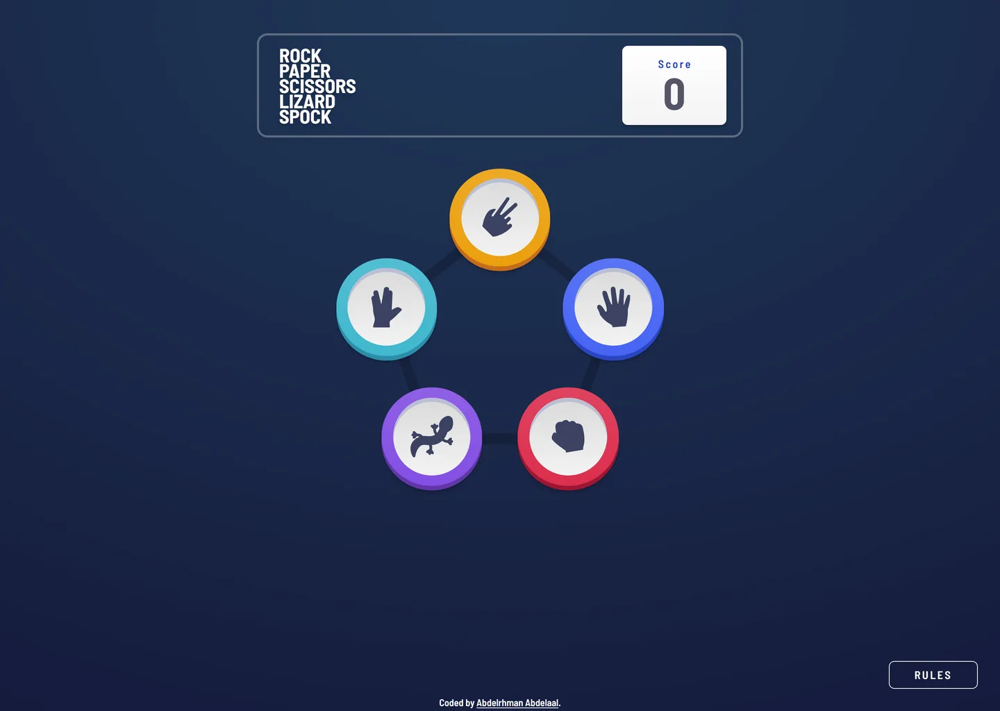

# Frontend Mentor - Rock, Paper, Scissors game solution

This is a solution to the [Rock, Paper, Scissors game challenge on Frontend Mentor](https://www.frontendmentor.io/challenges/rock-paper-scissors-game-pTgwgvgH). Frontend Mentor challenges help you improve your coding skills by building realistic projects.

## Table of contents

- [Overview](#overview)
  - [Screenshot](#screenshot)
  - [Links](#links)
- [My process](#my-process)
  - [Built with](#built-with)
  - [Design deviations](#design-deviations)
- [Author](#author)

## Overview

### Screenshot

### Links

- Solution URL: [GitHub](https://github.com/MrBlackvanta/rock-paper-scissors-game)
- Live Site URL: [Netlify](https://vanta-rock-paper-scissors-game.netlify.app)

## My process

### Built with

- [Next.js 16](https://nextjs.org/)
- [React 19](https://react.dev/)
- [TypeScript](https://www.typescriptlang.org/) (strict)
- [Tailwind CSS v4](https://tailwindcss.com/)

### Design deviations

| #   | Deviation                                                         | Why                                                                                                                                                                                                                                                                                                                                                          |
| --- | ----------------------------------------------------------------- | ------------------------------------------------------------------------------------------------------------------------------------------------------------------------------------------------------------------------------------------------------------------------------------------------------------------------------------------------------------ |
| 1   | `BEATS` labels and arrows darkened `#B1B4C5` → `#707594`          | Design value is 2.06:1 on white — under AA for the labels and under the 3:1 non-text minimum for the arrows, which carry the direction of each rule. `#707594` is the lightest value reaching 4.5:1.                                                                                                                                                         |
| 2   | Modal close glyph raised from 25% → 60% opacity                   | 25% composites to `#CED0D8` = **1.54:1**; an interactive control needs 3:1 (WCAG 1.4.11). 60% = 3.26:1.                                                                                                                                                                                                                                                      |
| 3   | Diagram coin rings and hands left at design values                | 2.06:1 and 2.48:1 — below the 3:1 non-text minimum, but darkening them changes the illustration itself, and neither carries meaning the arrows and labels don't already. The `sr-only` rules list states every rule losslessly.                                                                                                                              |
| 4   | Lizard coin left at `#834EE3`                                     | 2.88:1 against the backdrop. Kept deliberately — it is a brand colour and the coin is labelled.                                                                                                                                                                                                                                                              |
| 5   | Footer attribution added                                          | Repo convention; the design has no footer.                                                                                                                                                                                                                                                                                                                   |
| 6   | RULES button is `position: fixed` from `md` up only               | The design floats it 32px off the viewport bottom, but in flow it overflows 1366×768 by 15px and spawns a scrollbar. Mobile keeps it in flow (`mt-auto`), which still lands the designed 56px when there is room and drops it below the result view when there isn't — fixed would sit on top of PLAY AGAIN on any viewport shorter than the design's 750px. |
| 7   | Rules diagram `viewBox` is `0 0 336 330`, not the asset's 340×330 | 336×330 is the design's true content box; the exported SVG carries 4px of empty right-hand slack. Verified analytically that nothing draws past x=336.                                                                                                                                                                                                       |
| 8   | Mobile rules diagram scales uniformly                             | The design shrinks the artwork to ~92.5% on mobile but leaves the labels at 11px/6px. Scaling the whole SVG costs ~0.8px on the label size and avoids shipping two diagrams.                                                                                                                                                                                 |
| 9   | Tablet layout designed from scratch                               | The file has 375 and 1366 frames only. The header switches at `md` (768) and the duel at `lg` (1024); the rules modal switches from a full-bleed sheet to the 400px panel at `md` to match.                                                                                                                                                                  |
| 10  | Result column stays allocated from `lg` up                        | Revealing a verdict would otherwise _insert_ a 220px box, which no transition can animate. The picks translate ±140px instead — a compositor-friendly tween.                                                                                                                                                                                                 |

Faithful, though they look like mistakes: the paper coin in the rules diagram really is 4px shorter than the other four, the inner `BEATS` labels really are 6px against 11px on the outer ones, and the coin face is a 2.5%-squashed ellipse (1450:1414) rather than a circle. All three are confirmed in the `.fig`.

Not a deviation: a 1px border computes to 0.8px on a 1.25 DPR display. Chrome floors borders to whole device pixels.

## Author

- Frontend Mentor - [@MrBlackvanta](https://www.frontendmentor.io/profile/MrBlackvanta)
- LinkedIn - [Abdelrhman Abdelaal](https://www.linkedin.com/in/abdelrhman-vanta/)
